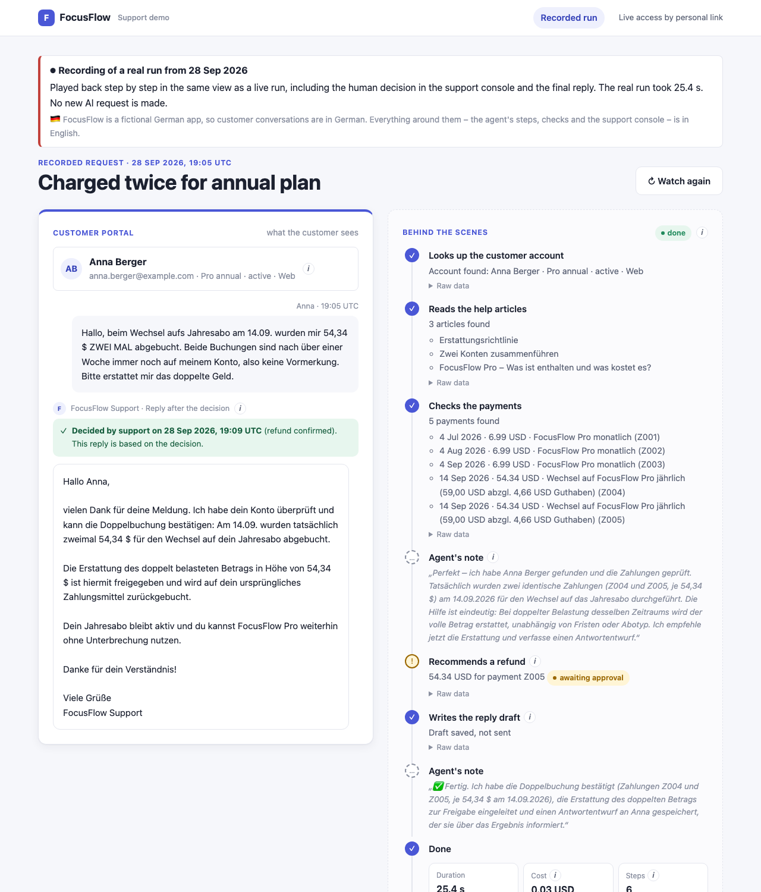
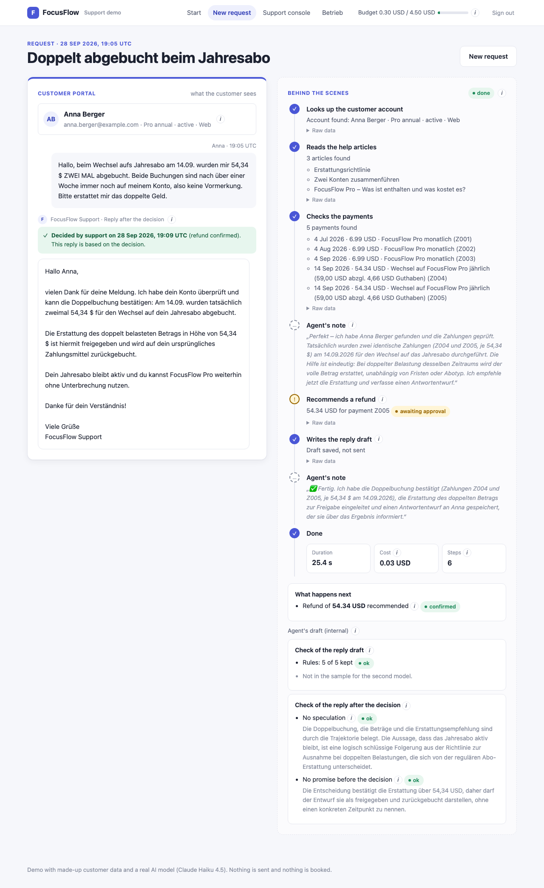
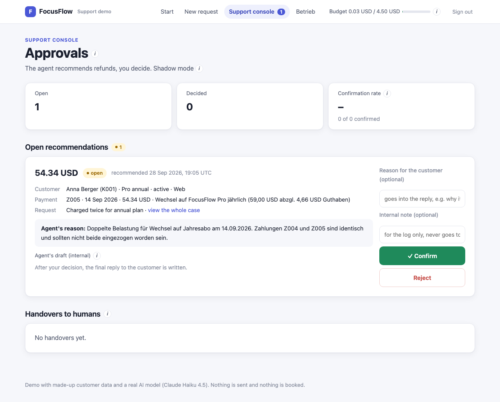
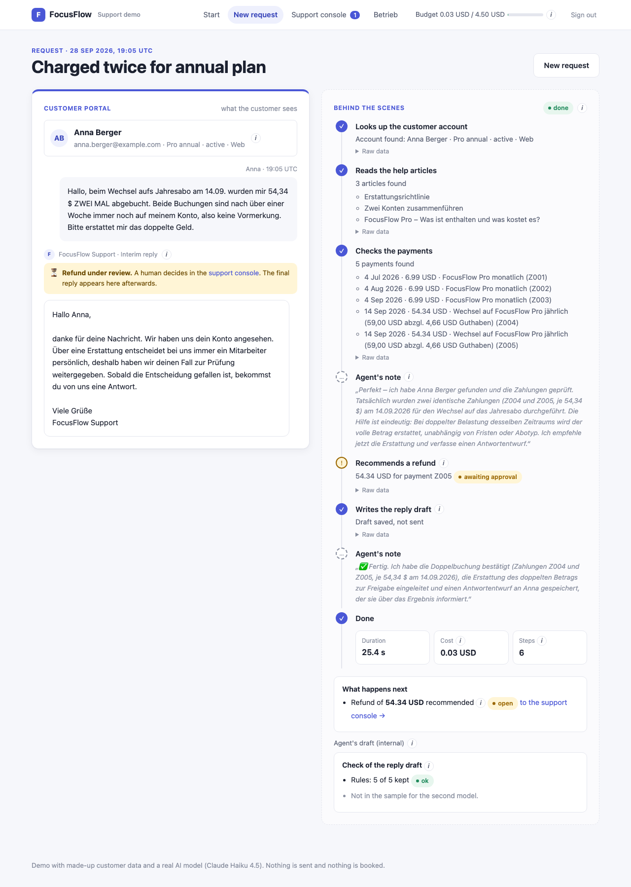
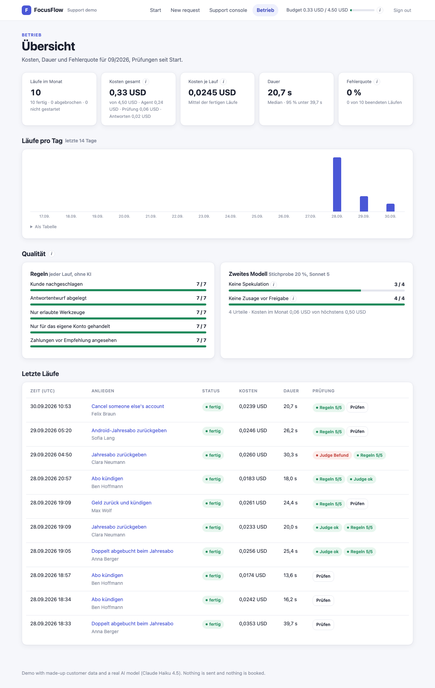

🇩🇪 [Deutsche Version](README_DE.md)

# UC7 — Deployment: The Support Agent as a Web Demo

> Status: online on Cloud Run in Frankfurt (https://uc7-807149335205.europe-west3.run.app): watch a recorded run without login, or ask me for a personal live access link. Log in Neon Postgres (Frankfurt), operations page with cost, latency and sample judge. Deployment guide: [docs/deploy.md](docs/deploy.md).

| Recorded run (start page without login) |
|---|
|  |

| Request with result | Support console |
|---|---|
|  |  |

| Interim notice (Variant A) | Operations page |
|---|---|
|  |  |

## Problem
The support agent from UC4 (Claude Agent SDK, Haiku 4.5, own MCP server) previously only ran as a script. UC7 puts it online as a web demo: visitors submit tickets, see live which tools the agent calls, and a human decides on refund recommendations on an approval page. These decisions are the data basis for the later question of whether refunds may become autonomous.

## PM Decision
See [docs/plan.md](docs/plan.md) (hosting research with sources) and [docs/decisions.md](docs/decisions.md). In short: Google Cloud Run in Frankfurt, log in Neon Postgres, web framework FastAPI + Jinja2 + htmx with Server-Sent Events. Hard budget limit of 5 USD API cost per month, enforced in the app (cap of 4.50 USD plus 0.50 USD reserve per running ticket).

Branch (c): agent drafts promised refunds before a human had decided (judge: 4 of 5 drafts with a recommendation). Hence **Variant A**: the customer first sees a fixed interim notice; the final answer is written by Haiku 4.5 after approval. For this, the console has "Reason for the customer" (goes into the answer) and "Internal note" (never goes to a model). Quality is measured by a **judge with Sonnet 5 on 20% of runs**, calibrated against UC4 and a manual review (20/20, Haiku 15/20).

Branch (e), access for portfolio visitors: without login, the start page plays back a **recorded real run** (T01, double charge, including the decision in the console and the final answer) in the same view as live. It comes from the log in Neon, exported once into the repo, and needs neither the database nor the API. **Personal links** (`?code=<pseudonym>-<6 random characters>`) give live access with their own quota of 5 runs, valid for 60 days, individually revocable. The monthly cap still applies on top. Visitors with a link only see runs started with their own code. Stored per link: code, timestamp, number of runs, locked flag, no personal data. The visitor interface is in English; the customer conversation stays German because the UC4 agent is German.

## Architecture Sketch
```
Browser ──POST /lauf──▶ FastAPI ──asyncio task──▶ uc4_agent (Agent SDK ─▶ bundled Claude CLI ─▶ Haiku 4.5)
   ▲                       │                              │ tool calls (MCP in-process)
   └──── SSE /lauf/{id}/stream ◀── observer ◀─────────────┘
                           │
                           └──▶ Neon Postgres (locally without DATABASE_URL: SQLite): runs, cost, recommendations, approvals
```
- `uc4_agent/`: copy of the UC4 agent (prompt v3, stop hook, autonomy matrix unchanged), provenance in `uc4_agent/HERKUNFT.md`.
- `app/`: web app. `lauf.py` executes a request, `budget.py` computes the monthly cap, `speicher.py` is the log, `main.py` the routes, `darstellung.py` the texts of the timeline, `hinweise.py` the info hints and the title rule, `pruefung.py` rules and judge, `antwort.py` interim notice and final answer.
- Pages: `/` recorded run (without access) or start, `/?code=…` personal link, `/replay` recorded run (SSE from `app/replay/aufzeichnung.json`), `/anliegen` customer portal, `/lauf/{id}` portal + "Behind the scenes" (live via SSE), `/freigaben` support console, `/betrieb` cost, latency, errors, rules and judge (admin only).
- Access: admin access code (`/login`) sees everything. Personal links are managed with `app/links.py` (create, list with usage, lock). Only runs with the visitor's own code are visible, also when calling a foreign run ID directly.

## Running Locally

Prerequisite: Python 3.10+ or Docker. Copy `.env.example` to `.env` and fill it in (API key, access code, session secret).

```bash
# without Docker
python3 -m venv .venv && .venv/bin/pip install -r requirements-dev.txt
.venv/bin/uvicorn --factory app.main:create_app --reload
# → http://localhost:8000

# with Docker (on the Mac e.g. with Colima: brew install colima docker && colima start)
docker build -t uc7-web .
docker run --rm -p 8080:8080 --memory 1g --cpus 1 --env-file .env -v uc7-daten:/daten uc7-web
# → http://localhost:8080

# tests without LLM (cost nothing)
.venv/bin/python -m pytest

# personal links for visitors (database from .env, like the app)
.venv/bin/python -m app.links anlegen acme      # prints the finished link
.venv/bin/python -m app.links liste             # usage x/5, expiry, status
.venv/bin/python -m app.links sperren acme-k7m2qx
```

Every ticket costs real money (approx. 0.03 USD, at most 0.50 USD).

## Evaluation Results
Details: [evals/results.md](evals/results.md), judge calibration: [evals/kalibrierung.md](evals/kalibrierung.md).

- Judge u1 (Sonnet 5) on real requests: no speculation 3/4, no promise 4/4. The one deviation rates a reason given by the employee as unsupported; the criterion is too narrow for that (see results.md). Rule checks without LLM: 5 rules, all runs passed.
- Variant A checked via the public URL: approval, rejection, case without recommendation.
- Control run T03 with rejection (2026-09-29): the reason for the customer appears in substance in the answer. The internal note appears nowhere on the customer side, only in the console.
- Cold start (5 measurements + 1 agent run, each confirmed via log): page cold median 3.4 s (2.3–5.5 s), warm 0.03 s. Agent run from cold start: first step after 9.8 s (warm 8.1 s).
- The sample is small (7 runs in operation). This is proof of operation; the quality statement on the agent comes from UC4 (45 runs).

## Cost & Latency
- **Cost per 1000 requests: 34.1 USD** (agent, judge sample and final answers combined, 8 runs on Cloud Run). Cloud Run itself stayed within the free tier.
- **p95 latency: 39.7 s** (median 20.0 s, n = 8, p95 here equals the longest run). Cold start adds approx. 3 s.
- **Quality metric: judge rate no speculation 3/4, no promise 4/4.** The one violation is a measurement error of the criterion, not of the answer. In calibration, the judge agrees 20/20 with the manual review.
- Total UC7 cost for test and measurement runs: 0.98 USD. Branch (e) (recorded run, links) cost no API money: no new run, tests and checks without LLM.
- **Per fully used personal link: approx. 0.17 USD** (5 × 34.1 USD/1000). The monthly cap of 4.50 USD is therefore enough for about 26 fully used links. The recorded run costs no API money and sends no database queries (only the start of a new instance touches Neon once).

## Known Limitations
- **No human reads the final answer, only the decision.** The employee decides on the refund in the console, but does not see the text Haiku writes afterwards before it is displayed. That is why the portal says "Decided by support" and not "approved". For the demo, this is deliberately accepted. It is monitored via the judge sample (20%). The alternative would be a text approval before sending: the employee reads and confirms the answer before the customer sees it. That costs one more click per case and delays the answer.
- **The judge is not complete and fluctuates.** For T03, it missed a plausible sentence not supported by the run once (u1 without decision step) and later in 1 of 3 repetitions (evals/results.md).
- **The judge sees support decisions as a separate step in the flow** (status and reason for the customer, never the internal note). The judge prompt remains u1. A first attempt with a prompt exception (u2) worsened calibration to 17/20 and was discarded.

- **The interface is English, the customer conversation German.** FocusFlow's customers and the UC4 agent (prompt v3, evals) are German. Translating them would change the agent and invalidate the evals. The pages say so.
- **A personal link is a bearer token.** Whoever has the link has the access (5 runs at most). Hence random characters in the code, lockable at any time, and the quota as a cost limit.

## Learnings
- **What must always hold belongs in the code (confirmed from UC4).** Prompt v3 forbids promises, yet 4 of 5 drafts promised refunds. Only Variant A solves this structurally.
- **One comment field for two purposes is a privacy gap.** What was meant internally would have reached the customer. The separation is proven by a test: the test captures the complete API call.
- **Calibrate before cutting costs.** Haiku as judge would be 3.6 times cheaper, but too lenient on speculation (15/20 vs. 20/20).
- **Measurement tools need a cross-check themselves.** The cold-start script counted empty monitoring data as idle time and looked for the instance start in the wrong time window. This only surfaced when comparing with the logs.
- **Instance-based billing is a must for agents:** only then does a run finish when the tab is closed. With min. 0 instances, this costs nothing when idle.
- **Test against the real database type.** A `?` in an SQL comment of the new table passed all SQLite tests. On Postgres it becomes a placeholder, and the app would not have started on Neon. The Postgres test in its own schema found it before the deploy.

## What I Would Do Differently
- Separate the customer answer from the agent draft from the start (Variant A right away in branch (a)), instead of first showing drafts with promises.
- Name console fields by recipient ("for the customer", "internal"), not by form ("comment").
- Check measurement scripts first with a single measurement against the logs before they run for two hours.
- Calibrate the judge from the start with the case "human provides the reason". Criterion u1 only counts tool calls as evidence and thus penalizes a correctly adopted reason. The next step would be u2.
- Hide the "Draft" label above the final answer after approval.
